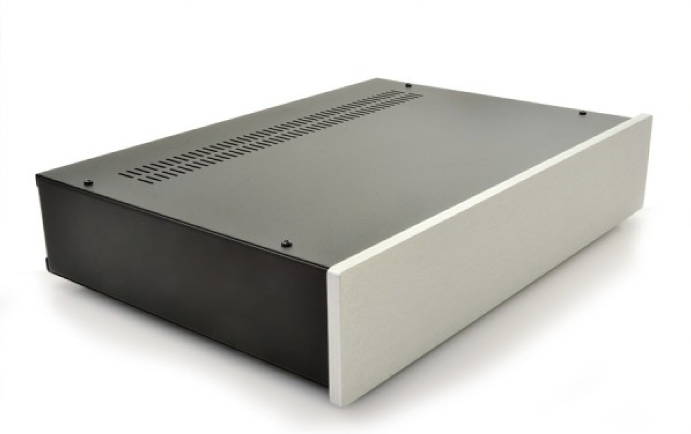
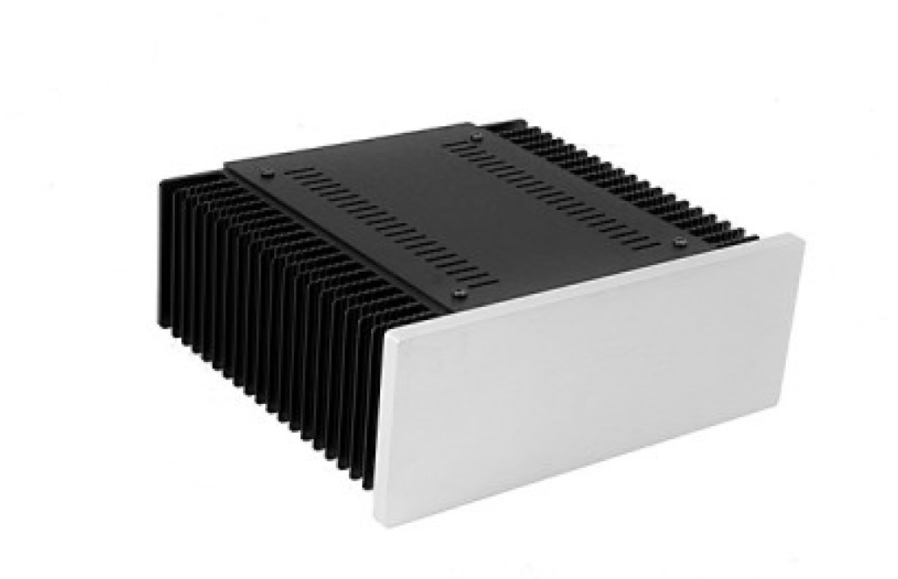

## Enclosures

There are two different enclosures used in this project.

### Main Amplifier Chassis

The main amplifier uses the Pesante 2U case with 10mm front panel from [modushop.biz](https://modushop.biz/site/index.php?route=product/product&path=171_229&product_id=157).

### Monoblocks

There are also two monoblocks (technically duo-blocks, as they contain two channels each) that use the Mini-dissipante 2U cases also from [moduship.biz](https://modushop.biz/site/index.php?route=product/product&path=284&product_id=735).