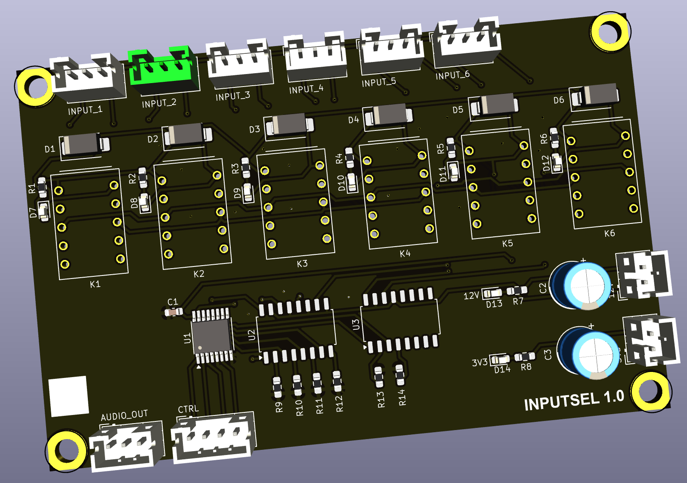

## Audio Input Selector

This PCB allows switching of 6 RCA analog stereo inputs using gold-plated small signal relays.

### Version History

- 1.0: Initial Release

### Speciality Components

* 6x KEMET EA2 12V relays
* 2x TCMT4600 quad optocoupler
* CD74AC238 3->8 digital decoder

[Return to main page](/)