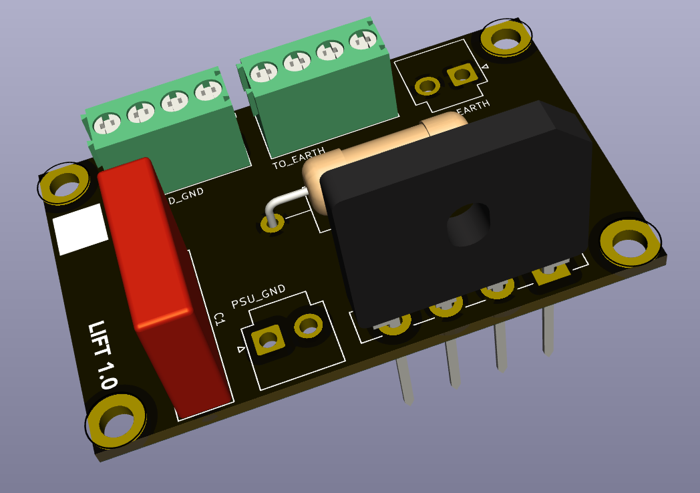

## Ground Lift

This PCB allows the audio ground to be isolated from the IEC earth connection.

*Warning: while a circuit of this nature is generally considered safe when implemented properly, ground lift circuits can be illegal in some juridictions. Make sure you understand the implications of this type of circuit before you implement it, and ensure it's safe to do so.*

### Version History

- 1.0: Initial Release

[Return to main page](/)