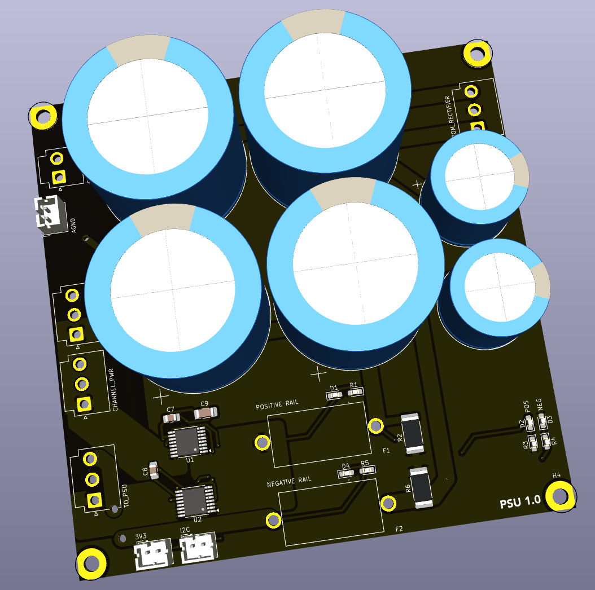

## Main Amplifier Channel Power Supply

This board is the main power reservoir for the main +/- 32V power supplies.  

### Version History

- 1.0: Initial Release

### Speciality Components

* 30x50mm 15000uF 50V capacitors
* 5x20mm fuse holders
* 2x INA260 current monitors

[Return to main page](/)
