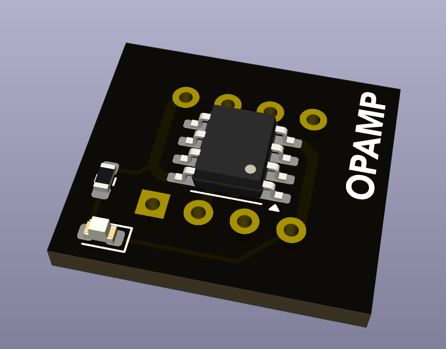

## SOIC To DIP Adapter

This is a utility board meant to convert a SOIC operational amplifier into a DIP socket.  This allows a person to "roll" different operational amplifiers to see which one they prefer in their system.

[Return to main page](/)

