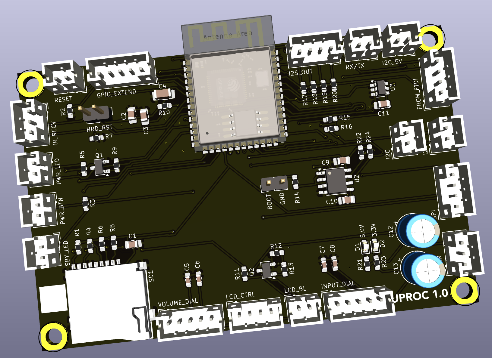

## Microprocessor Board

The heart of the amplifier is this microprocessor board based on the ESP32 WROOM-S3 IC. 

### Version History

- 1.0: Initial Release

### Speciality Components

* ESP32 WROOM 32
* TMP100 temperature sensor
* TCA9517DR level shifter for I2C bus
* TF-115-BCP9 micro SD card reader

[Return to main page](/)

