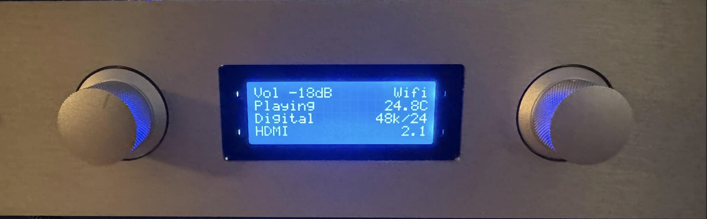

## Overview

This project entails the two-year effort by myself, [Duane Storey](https://duanestorey.com), to create a fully-functional, extensible, open-source high-fidelity home-audio amplifier with built-in active crossover and room correction ability. 

### License 

Everything in this repository is licensed under the [BY-NC-SA 4.0 creative commons license](https://creativecommons.org/licenses/by-nc-sa/4.0/) which allows for non-commercial usage - if you're a hobbyist or DIY enthusiast, you are free to use the code and designs under the terms linked above. For commercial inquiries, please contact me directly.

### Contents

Please browse the following sections for more information about the project.

- [Technical Specs](specs.md)
- [History](history.md)
- [Philosophy](philosophy.md)
- [Design Guides](design-guides.md)
- [Enclosures](enclosures.md)
- [Cables & Connectors](cables.md)
- [Hardware](hardware/index.md)
- [Build](build/index.md)
- [Software](software/index.md)
- [Test](test.md)

### Contact

You can contact me directly at duanestorey (at) gmail.com, or by opening a discussion or issue on the [main repository page](https://github.com/duanestorey/hifi-amp). 