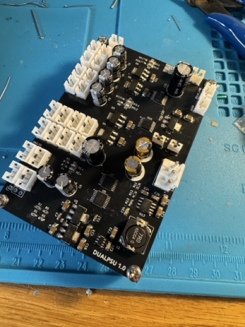

## Log

This is chronological log of everything I've done on the project.  I'll backfill it as I go, but will also use it to keep track of changes/additions and the thought process along the way.

### Updates

+ February 15, 2025:
    * I changed the resistors on the LM317/337 to 300/2700. The current has gone down a bit, but temperature of the board is still 42.9C. That's not horrible, but I'll probably toss a little Raspberry Pi heatsink on it and see if it changes.
    * Worked on the monoblocks.  Mounted the LM3886 to the heatsinks and started wiring up the power XLR in the main amplifier. For some reason the 3.3V line isn't working, so I'll debug in the morning.  Sometime in the next few days I'll wire up the power to the monoblocks.
+ February 14, 2025: 
    * I tried connecting to the INA260 power meter ICs but I was getting inconsisent results.  After consulting with the datasheet and my schematic, I was pretty sure I was using it correctly. I decided that it might be due to using some ICs I got from China, so I redid the board using INA260s purchased from Mouser - low and behold they started working properly.  So mental note, don't use ICs from Aliexpress.  
    
    * One of the things I realized right away using the information from the power ICs is that the opamps were using nearly 27ma of current.  The datasheet says they should only use 3-4ma each, and there are four of them, so I expected more like 16ma, not 27ma.  There are of course a few LEDs, but I kept the current on those to about 1ma per LED. After doing some investigation, I realized the feedback circuit itself was using 11ma of current due to the low values of resistors I used from the datasheet.  I looked online and the LM317 chip can handle as low as 3.5ma for the load current, so I decided to change the resistor combination to 300R/2700R, which should put it as more like 4ma of current.
    

[Return to main page](/)
